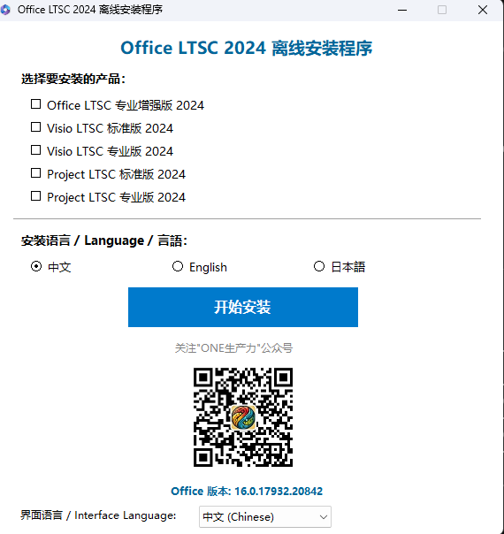
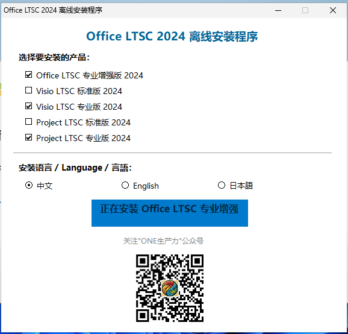
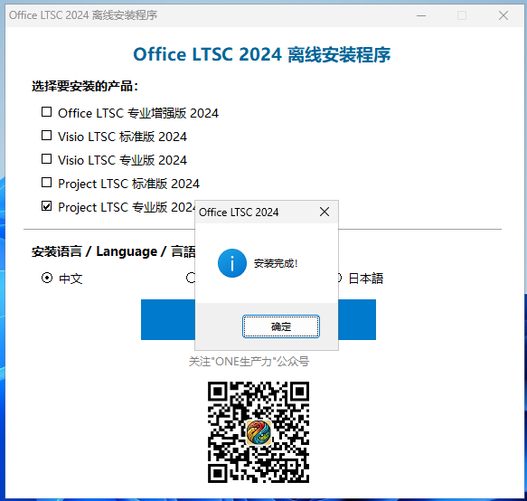

# Office LTSC 2024 Offline ISO Builder

> 中文 | [English](#english) | [日本語](#japanese)

一个用于创建 Office LTSC 2024 离线安装 ISO 镜像的工具集。包含多语言 GUI 安装程序、自动更新脚本和 ISO 构建工具。

## 截图

| 中文 | English | 日本語 |
|:---:|:---:|:---:|
|  |  |  |

## 功能特性

- **离线安装 ISO** — 创建包含完整 Office LTSC 2024 安装文件的 ISO 镜像
- **多语言 GUI** — 安装程序支持中文、英文、日文，根据系统语言自动切换（默认英文）
- **多产品选择** — 支持 Office、Visio、Project 的多个版本
- **零依赖** — GUI 程序基于 .NET Framework 4.8，Windows 10/11 内置，无需安装额外组件
- **自动更新** — 一键脚本更新 Office 安装文件并重新生成 ISO
- **版本显示** — 自动检测并显示当前 Office 安装文件版本号

## 包含的产品

| 产品 | 产品 ID | 版本 |
|------|---------|------|
| Office LTSC 专业增强版 2024 | `ProPlus2024Volume` | 标准版/专业版 |
| Visio LTSC 标准版 2024 | `VisioStd2024Volume` | 标准版 |
| Visio LTSC 专业版 2024 | `VisioPro2024Volume` | 专业版 |
| Project LTSC 标准版 2024 | `ProjectStd2024Volume` | 标准版 |
| Project LTSC 专业版 2024 | `ProjectPro2024Volume` | 专业版 |

支持语言：**中文 (zh-cn)**、**英文 (en-us)**、**日文 (ja-jp)**

## 项目结构

```
Office-Offline-ISO/
├── README.md
├── autorun.inf                    # ISO 自动运行配置
├── .gitignore
├── configs/
│   └── download.xml               # Office 下载配置文件
├── launcher/
│   ├── OfficeInstaller.cs         # GUI 安装程序源码 (C# WinForms)
│   ├── IsoBuilder.cs              # ISO 构建工具源码
│   ├── PngToIcon.cs               # PNG 转 ICO 工具源码
│   ├── Office.ico                 # 程序图标
│   ├── Office.png                 # 图标源文件
│   └── qr.jpg                     # 公众号二维码
├── scripts/
│   └── update_rebuild_iso.ps1     # 一键更新与重建脚本
└── screenshots/
    ├── launcher_zh.png
    ├── launcher_en.png
    └── launcher_ja.png
```

## 快速开始

### 1. 下载 Office 部署工具

从 [Microsoft 官方](https://www.microsoft.com/en-us/download/details.aspx?id=49117) 下载 Office Deployment Tool，将 `setup.exe` 放到项目根目录。

### 2. 下载 Office 安装文件

```powershell
.\setup.exe /download .\configs\download.xml
```

### 3. 编译 GUI 安装程序

```powershell
# 使用 .NET Framework 内置的 csc.exe 编译
C:\Windows\Microsoft.NET\Framework64\v4.0.30319\csc.exe `
  /target:winexe `
  /win32icon:launcher\Office.ico `
  /out:launcher\OfficeInstaller.exe `
  /reference:System.Windows.Forms.dll `
  /reference:System.Drawing.dll `
  /reference:System.dll `
  launcher\OfficeInstaller.cs
```

### 4. 构建 ISO

```powershell
# 一键构建（推荐）
.\scripts\update_rebuild_iso.ps1 -SkipDownload

# 或手动构建
# 先将文件复制到 iso_root 目录，然后运行：
.\launcher\IsoBuilder.exe iso_root Office_LTSC_2024.iso OLTSC2024
```

### 5. 更新与重建

```powershell
# 下载最新 Office 文件并重建 ISO
.\scripts\update_rebuild_iso.ps1

# 仅重建（跳过下载）
.\scripts\update_rebuild_iso.ps1 -SkipDownload
```

## 技术栈

- **GUI**: C# WinForms (.NET Framework 4.8)
- **ISO 构建**: IMAPI2 COM 接口
- **编译**: `csc.exe` (Visual C# Compiler，Windows 内置)
- **脚本**: PowerShell 5.1+
- **Office 部署**: Microsoft Office Deployment Tool

## 系统要求

- Windows 10/11 (x64)
- .NET Framework 4.8 (系统内置)
- PowerShell 5.1+

---

## English

A toolkit for creating Office LTSC 2024 offline installation ISO images. Includes a multilingual GUI installer, auto-update script, and ISO builder.

## Features

- **Offline ISO** — Create ISO images with complete Office LTSC 2024 installation files
- **Multilingual GUI** — Supports Chinese, English, Japanese with auto-detection (default: English)
- **Multi-Product** — Select from Office, Visio, and Project editions
- **Zero Dependencies** — Built on .NET Framework 4.8 (pre-installed in Windows 10/11)
- **Auto-Update** — One-click script to refresh Office files and rebuild ISO
- **Version Display** — Auto-detects and shows current Office file version

## Included Products

| Product | Product ID |
|---------|------------|
| Office LTSC Professional Plus 2024 | `ProPlus2024Volume` |
| Visio LTSC Standard 2024 | `VisioStd2024Volume` |
| Visio LTSC Professional 2024 | `VisioPro2024Volume` |
| Project LTSC Standard 2024 | `ProjectStd2024Volume` |
| Project LTSC Professional 2024 | `ProjectPro2024Volume` |

Languages: **Chinese (zh-cn)**, **English (en-us)**, **Japanese (ja-jp)**

## Quick Start

### 1. Download Office Deployment Tool

Download from [Microsoft](https://www.microsoft.com/en-us/download/details.aspx?id=49117) and place `setup.exe` in the project root.

### 2. Download Office Files

```powershell
.\setup.exe /download .\configs\download.xml
```

### 3. Compile the GUI Launcher

```powershell
C:\Windows\Microsoft.NET\Framework64\v4.0.30319\csc.exe `
  /target:winexe `
  /win32icon:launcher\Office.ico `
  /out:launcher\OfficeInstaller.exe `
  /reference:System.Windows.Forms.dll `
  /reference:System.Drawing.dll `
  /reference:System.dll `
  launcher\OfficeInstaller.cs
```

### 4. Build ISO

```powershell
.\scripts\update_rebuild_iso.ps1 -SkipDownload
```

### 5. Update & Rebuild

```powershell
.\scripts\update_rebuild_iso.ps1
```

## Tech Stack

- **GUI**: C# WinForms (.NET Framework 4.8)
- **ISO Builder**: IMAPI2 COM interface
- **Compiler**: `csc.exe` (Visual C# Compiler, built into Windows)
- **Scripting**: PowerShell 5.1+
- **Office Deployment**: Microsoft Office Deployment Tool

---

## 日本語

Office LTSC 2024 オフラインインストール ISO イメージを作成するためのツールキットです。多言語 GUI インストーラー、自動更新スクリプト、ISO ビルダーが含まれています。

## 機能

- **オフライン ISO** — 完全な Office LTSC 2024 インストールファイルを含む ISO イメージを作成
- **多言語 GUI** — 中国語、英語、日本語に対応し、システム言語を自動検出（デフォルト：英語）
- **複数製品** — Office、Visio、Project の各エディションから選択可能
- **依存関係なし** — .NET Framework 4.8（Windows 10/11 に標準搭載）上で動作
- **自動更新** — ワンクリックで Office ファイルを更新し ISO を再構築
- **バージョン表示** — 現在の Office ファイルのバージョンを自動検出して表示

## 含まれる製品

| 製品 | 製品 ID |
|------|---------|
| Office LTSC プロフェッショナル プラス 2024 | `ProPlus2024Volume` |
| Visio LTSC スタンダード 2024 | `VisioStd2024Volume` |
| Visio LTSC プロフェッショナル 2024 | `VisioPro2024Volume` |
| Project LTSC スタンダード 2024 | `ProjectStd2024Volume` |
| Project LTSC プロフェッショナル 2024 | `ProjectPro2024Volume` |

言語：**中国語 (zh-cn)**、**英語 (en-us)**、**日本語 (ja-jp)**

## クイックスタート

### 1. Office 展開ツールのダウンロード

[Microsoft](https://www.microsoft.com/en-us/download/details.aspx?id=49117) からダウンロードし、`setup.exe` をプロジェクトのルートに配置します。

### 2. Office ファイルのダウンロード

```powershell
.\setup.exe /download .\configs\download.xml
```

### 3. GUI ランチャーのコンパイル

```powershell
C:\Windows\Microsoft.NET\Framework64\v4.0.30319\csc.exe `
  /target:winexe `
  /win32icon:launcher\Office.ico `
  /out:launcher\OfficeInstaller.exe `
  /reference:System.Windows.Forms.dll `
  /reference:System.Drawing.dll `
  /reference:System.dll `
  launcher\OfficeInstaller.cs
```

### 4. ISO のビルド

```powershell
.\scripts\update_rebuild_iso.ps1 -SkipDownload
```

### 5. 更新と再ビルド

```powershell
.\scripts\update_rebuild_iso.ps1
```

## 技術スタック

- **GUI**: C# WinForms (.NET Framework 4.8)
- **ISO ビルダー**: IMAPI2 COM インターフェース
- **コンパイラ**: `csc.exe` (Visual C# Compiler、Windows に標準搭載)
- **スクリプト**: PowerShell 5.1+
- **Office 展開**: Microsoft Office Deployment Tool

---

## License

This project is for educational purposes. Office LTSC 2024 requires a valid license from Microsoft.

## QR Code

The QR code in the launcher links to the "ONE生产力" WeChat official account.